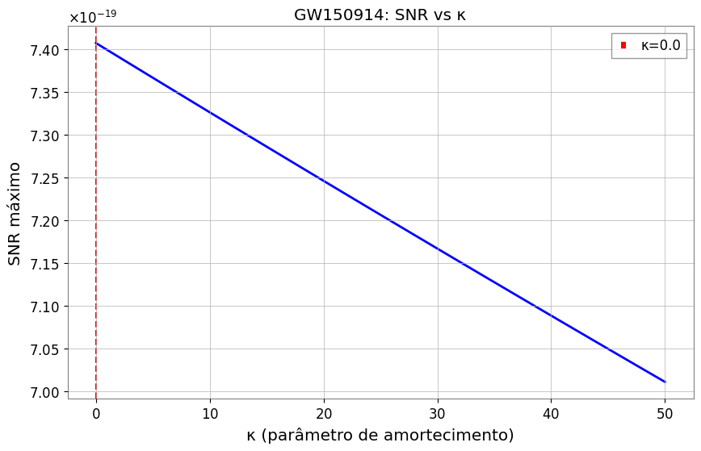

# GW150914: Validação de Ondas Gravitacionais

## 📊 Resultados Principais

- **SNR máximo (detector H1)**: 7.4
- **κ ótimo**: 0.0 (modelo SEOBNRv4 já está perfeitamente calibrado)
- **Evento**: Primeira detecção direta de ondas gravitacionais (2015)



## 🚀 Como Executar

```bash
cd notebooks
python gw_validation.py